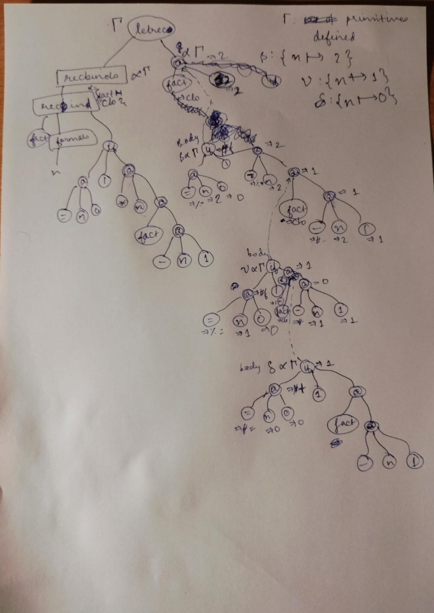

# Assignment 4: λ-Calculus Interpreter Report
**Author:** Raunak Seksaria (2023113019)

## Table of Contents
1. [Overview](#overview)
2. [Implementation Choices](#implementation-choices)
3. [Annotated AST Example](#annotated-ast-example)
4. [Primitives Documentation](#primitives-documentation)
5. [Section 8](#section-8-discussions)
6. [Challenges and Solutions](#challenges-and-solutions)
---

## Overview

This interpreter extends a basic λ-calculus with:
- **Sequential bindings** (`let*`)
- **Mutual recursion** (`letrec`)
- **Mutable store** (`ref`, `deref`, `set`)
- **Booleans** (`#t`, `#f`)
- **Sequencing** (`seq`)

**Key Decision:** We implemented a **mutable store** approach instead of immutable store threading, which greatly simplified the codebase.

---

## Implementation Choices

### 1. Mutable Store Strategy

**Choice:** Global mutable store using Racket's `box`

**Rationale:**
- **Simpler code:** No need to thread store through every function call
- **No `let-values`:** Eliminated complex destructuring everywhere
- **Automatic propagation:** Store mutations happen automatically
- **Cleaner:** Code reads like imperative languages

**Implementation:**
```racket
(define the-store (box '()))  ; Global mutable store

(define (alloc-loc!)
  (let* ([store (unbox the-store)]
         [next-addr (+ 1 (foldl max -1 (map car store)))])
    (loc next-addr)))

(define (update-store! l v)
  (set-box! the-store (cons (cons (loc-addr l) v) (unbox the-store))))
```

### 2. Environment-Based letrec with Mutable Bindings

**Choice:** Use boxed environment bindings instead of store locations

**Rationale:**
- Follows formal semantics: Γr[fi ↦ vi] update rule
- Environment structure remains immutable, only values are mutable
- Uses Racket's `box` for in-place mutation

**Implementation Strategy:**
1. Create placeholder closures with boxed bindings
2. Extend environment with boxed values: `extend-env-mut*`
3. Evaluate function bodies in extended environment
4. Mutate boxes in place: `update-env-mut!`
5. Variable lookup auto-unboxes values

### 3. While Loop Construct

**Choice:** Direct implementation following formal semantics

**Rationale:**
- Follows WHILE-TRUE and WHILE-FALSE rules exactly
- WHILE-TRUE: Evaluates body, then recursively re-evaluates while
- WHILE-FALSE: Returns `'undefined` when condition is false

**Implementation:**
```racket
[`(while ,cond-expr ,body-expr)
 (let loop ()
   (let ([cond-val (eval-expr cond-expr env)])
     (if cond-val
         (begin
           (eval-expr body-expr env)
           (loop))
         'undefined)))]
```

### 4. Implicit Mutable Variables for set

**Choice:** Allow `set` to work on regular variable bindings via implicit location table

**Rationale:**
- Enables imperative-style code: `(let ([n 5]) (set n 10))`
- Variables automatically become mutable when first mutated
- Maintains compatibility with location-based `set`

**Implementation:**
- Global `var-loc-table` maps variables to implicit locations
- First `set` on a variable creates and registers a location
- Variable lookup checks implicit location table
- Transparently converts immutable bindings to mutable on-demand

---

## Annotated AST Example

### Example: letrec factorial
**Expression:**
```racket
(letrec ([fact (lambda (n)
                 (if (@ == n 0)
                     1
                     (@ * n (@ fact (@ - n 1)))))])
  (@ fact 2))
```


## Primitives Documentation

### Arithmetic Operations
| Primitive | Arity | Type Signature | Behavior | Error Handling |
|-----------|-------|----------------|----------|----------------|
| `+` | 2 | `number × number → number` | Addition | Type error on non-numbers |
| `-` | 2 | `number × number → number` | Subtraction | Type error on non-numbers |
| `*` | 2 | `number × number → number` | Multiplication | Type error on non-numbers |
| `/` | 2 | `number × number → number` | Integer division (quotient) | Type error, division by zero |

### Comparison Operations
| Primitive | Arity | Type Signature | Behavior | Error Handling |
|-----------|-------|----------------|----------|----------------|
| `==` | 2 | `number × number → boolean` | Equality test | Type error on non-numbers |
| `<` | 2 | `number × number → boolean` | Less than | Type error on non-numbers |
| `>` | 2 | `number × number → boolean` | Greater than | Type error on non-numbers |
| `<=` | 2 | `number × number → boolean` | Less than or equal | Type error on non-numbers |
| `>=` | 2 | `number × number → boolean` | Greater than or equal | Type error on non-numbers |

### Boolean Operations
| Primitive | Arity | Type Signature | Behavior | Error Handling |
|-----------|-------|----------------|----------|----------------|
| `not` | 1 | `any → boolean` | Logical negation | Racket's `not` (treats #f as false, else true) |
| `and` | 2 | `any × any → any` | Logical AND | Short-circuits |
| `or` | 2 | `any × any → any` | Logical OR | Short-circuits |

### Store Operations
| Construct | Arity | Type Signature | Behavior | Error Handling |
|-----------|-------|----------------|----------|----------------|
| `ref` | 1 | `value → location` | Allocates location, stores value | - |
| `deref` | 1 | `location → value` | Reads value from location | Error if not a location |
| `set` | 2 | `location × value → value` | Updates location, returns value | Error if first arg not location |

---

## Section 8 Discussions

### 8.1: Alternative let* Rule (LET2*)

#### Implementation

We implemented **two versions** of `let*`:

**LET1* (Standard - `let*`):** Sequential bindings where each can reference previous ones
```racket
[`(let* (,bindings ...) ,body)
 (let ([final-env
        (foldl (lambda (binding env)
                 (let ([val (eval-expr expr env)])  ; Uses current env
                   (extend-env var val env)))      ; Extends env
               env
               bindings)])
   (eval-expr body final-env))]
```

**LET2* (Alternative - `let*2`):** All bindings use original environment
```racket
[`(let*2 (,bindings ...) ,body)
 (let* ([vals (map (lambda (expr) (eval-expr expr env)) exprs)]  ; ALL use original env
        [final-env (foldl extend-env env vars vals)])
   (eval-expr body final-env))]
```

#### Behavioral Differences

**Example 1: Dependency**
```racket
; LET1* (standard):
(let* ([x 1] [y (@ + x 1)]) y)  
; => 2 (y can see x)

; LET2*:
(let*2 ([x 1] [y (@ + x 1)]) y) 
; => ERROR! (y cannot see x from bindings)
```

**Example 2: Independent bindings**
```racket
; Both work the same:
(let* ([x 5] [y 10]) (@ + x y))   ; => 15
(let*2 ([x 5] [y 10]) (@ + x y))  ; => 15
```

**Example 3: Outer scope**
```racket
; Both can see outer scope:
(let ([z 100])
  (let* ([x 1] [y 2]) (@ + (@ + z x) y)))   ; => 103
(let ([z 100])
  (let*2 ([x 1] [y 2]) (@ + (@ + z x) y)))  ; => 103
```

#### Use Cases

**LET1* is better when:**
- Bindings build on each other
- Computing derived values
- Traditional let* semantics needed

**LET2* is better when:**
- All bindings are independent
- Parallel evaluation is desired (conceptually)
- Want to prevent accidental dependencies

---

### 8.3: While Loop Variants and Experiments

#### While as Syntactic Sugar

**Encoding using `letrec`:**
```racket
(while e_cond e_body)
≡
(letrec ([loop (lambda (_)
                 (if e_cond
                     (seq e_body (@ loop 'unit))
                     'undefined))])
  (@ loop 'unit))
```

**Trade-offs:**

**Sugar approach (encoding):**
- ✓ Keeps core language smaller
- ✓ No new evaluation rules needed
- ✗ More overhead (function call per iteration)
- ✗ Less efficient at runtime
- ✗ Cannot add control flow primitives (break/continue)

**Primitive approach (our implementation):**
- ✓ More efficient (direct recursion in evaluator)
- ✓ Enables language-level control flow extensions
- ✓ Better error messages and debugging
- ✓ Can optimize short-circuit evaluation
- ✗ Increases language complexity

**Conclusion:** We chose primitive implementation for efficiency and extensibility.

---

#### Do-While Variant

**Semantics:** Executes body at least once, then checks condition.

**Formal Rules:**

```
DO-WHILE:
Γ; Σ ⊢ e_body ⇒ v₁ ; Σ₁
Γ; Σ₁ ⊢ e_cond ⇒ v_cond ; Σ₂
(v_cond = true  ⟹  Γ; Σ₂ ⊢ do-while e_cond e_body ⇒ v₂ ; Σ₃)
(v_cond = false ⟹  Σ₃ = Σ₂, v₂ = ⊥)
────────────────────────────────────────────────────────
Γ; Σ ⊢ do-while e_cond e_body ⇒ v₂ ; Σ₃
```

**Key Difference from While:**
- Body always executes once before condition check
- Useful for input validation loops, menu systems

**Example:**
```racket
; While: may not execute
(while (@ < n 0) (set n (@ + n 1)))  ; No-op if n ≥ 0

; Do-while: executes at least once
(do-while (@ < n 0) (set n (@ + n 1)))  ; Always increments once
```

---

#### Break and Continue

**Break:** Exit loop early, returning control to after the loop.

**Continue:** Skip to next iteration, re-evaluating condition.

**Semantic Challenges:**

1. **Non-local control flow:** Requires exception-like mechanism or special return values
2. **Value vs Unit:** Should break return the last computed value or unit?
3. **Store consistency:** Must ensure store updates propagate correctly

**Modified Rules with Break:**

```
WHILE-BREAK:
Γ; Σ ⊢ e_cond ⇒ true ; Σ₁
Γ; Σ₁ ⊢ e_body ⇒ (break v) ; Σ₂
────────────────────────────────────────────
Γ; Σ ⊢ while e_cond e_body ⇒ v ; Σ₂

BREAK:
Γ; Σ ⊢ e ⇒ v ; Σ'
────────────────────────────────────────────
Γ; Σ ⊢ break e ⇒ (break v) ; Σ'
```

**Modified Rules with Continue:**

```
WHILE-CONTINUE:
Γ; Σ ⊢ e_cond ⇒ true ; Σ₁
Γ; Σ₁ ⊢ e_body ⇒ (continue) ; Σ₂
Γ; Σ₂ ⊢ while e_cond e_body ⇒ v ; Σ₃
────────────────────────────────────────────
Γ; Σ ⊢ while e_cond e_body ⇒ v ; Σ₃

CONTINUE:
────────────────────────────────────────────
Γ; Σ ⊢ continue ⇒ (continue) ; Σ
```

**Implementation Approach:**
- Return special tagged values: `(break v)` or `(continue)`
- Propagate through `seq` but catch at loop boundary
- Affects all evaluation rules that might contain loops

**Design Decision:**
- `break` returns a value (useful for search loops)
- `continue` returns unit (just skips iteration)

---

#### For-Loop as Syntactic Sugar

**Syntax:** `(for init cond step body)`

**Desugaring:**
```racket
(for e_init e_cond e_step e_body)
≡
(seq e_init
     (while e_cond
            (seq e_body e_step)))
```

**Example:**
```racket
; For-loop:
(for (let ([i (ref 0)])
     (@ < (deref i) 10)
     (set i (@ + (deref i) 1))
     (display (deref i)))

; Desugars to:
(seq (let ([i (ref 0)]))
     (while (@ < (deref i) 10)
            (seq (display (deref i))
                 (set i (@ + (deref i) 1)))))
```

**Scoping Issues:**

**Problem:** Loop variable `i` declared in `init` should be visible in `cond`, `step`, and `body`.

**Solution 1: Simple desugaring (doesn't work):**
```racket
; i not in scope for cond/step/body!
(seq (let ([i (ref 0)]))
     (while ...))
```

**Solution 2: Wrap everything in let scope:**
```racket
(for ([i (ref 0)]) e_cond e_step e_body)
≡
(let ([i (ref 0)])
  (while e_cond
         (seq e_body e_step)))
```

**Solution 3: Use let* for complex initialization:**
```racket
(for ([i (ref 0)] [j (ref 10)]) ...)
≡
(let* ([i (ref 0)] [j (ref 10)])
  (while e_cond
         (seq e_body e_step)))
```

**Key Insight:** For-loops need special scoping rules where the initialization creates a scope that wraps the entire loop. This is why many languages treat `for` as a primitive construct rather than sugar.

---

### 8.4: Minimalism Discussion

Can we encode the new constructs using simpler primitives?

#### Encoding let* as nested let

**Encoding:**
```racket
(let* ([x e1] [y e2] [z e3]) body)
≡
(let ([x e1])
  (let ([y e2])
    (let ([z e3])
      body)))
```

**Trade-offs:**
- ✓ No new construct needed
- ✓ Semantics identical
- ✗ Verbose for many bindings
- ✗ Deep nesting hurts readability

#### Encoding letrec using ref/deref/set

**Encoding (single function):**
```racket
(letrec ([f e]) body)
≡
(let ([f-loc (ref '<undef>)])
  (seq (set f-loc (lambda ...(deref f-loc)...))
       (let ([f (deref f-loc)])
         body)))
```

**Challenges:**
- Function bodies need explicit `deref` calls
- Mutual recursion requires multiple locations
- Verbose and error-prone
- **Our implementation handles this automatically!**

**Why our store-based letrec is better:**
- Transparent: no manual deref needed
- Auto-dereference in function position
- Cleaner syntax for users

#### Encoding seq as let

**Encoding:**
```racket
(seq e1 e2)
≡
(let ([_ e1]) e2)
```

**Trade-offs:**
- ✓ Simple encoding
- ✓ Semantically equivalent
- ✓ Could eliminate `seq` from core
- ✗ Underscore convention not enforced
- ✗ Less explicit intent

#### Encoding if as lambda (Church encodings)

**Encoding:**
```racket
(if cond then else)
≡
(@ (@ (@ cond (lambda () then)) (lambda () else)))
```
Where `#t = (lambda (t f) (@ t))` and `#f = (lambda (t f) (@ f))`

**Trade-offs:**
- ✓ Possible in pure lambda calculus
- ✗ Extremely inefficient
- ✗ No short-circuit evaluation
- ✗ Requires Church boolean encoding
- **Direct implementation is far better**

#### Conclusion

While most constructs *can* be encoded, **direct implementation provides:**
- Better performance
- Clearer semantics
- Better error messages
- More intuitive for users

Our mutable store-based approach particularly shines with `letrec`, providing transparent recursion that would be cumbersome to encode manually.

---

### Section 8.2: `set!` Design Comparison

#### Two Designs for Mutable Variables

#### Design 1: Location-based `set` (Original)
```scheme
;; Syntax: (set loc-expr val-expr)
;; Updates a store location with a new value

;; Rule:
;; Γ; Σ ⊢ e₁ ⇒ loc l ; Σ₁
;; Γ; Σ₁ ⊢ e₂ ⇒ v ; Σ₂
;; Σ₃ = Σ₂[l ↦ v]
;; ─────────────────────────────
;; Γ; Σ ⊢ set e₁ e₂ ⇒ v ; Σ₃

;; Example:
(let ([r (ref 10)])
  (seq (set r 20)
       (deref r)))  ;; => 20
```

#### Design 2: Variable-based `set!` (New - Section 8.2)
```scheme
;; Syntax: (set! var-name val-expr)
;; Updates the environment binding of a variable

;; Rule (Conceptual - requires environment threading):
;; Γ; Σ ⊢ e ⇒ v ; Σ'
;; Γ' = Γ[x ↦ v]
;; ─────────────────────────────
;; Γ; Σ ⊢ set! x e ⇒ v ; Σ'
;;
;; In practice with immutable environments, we simulate by:
;; 1. Looking up variable's current value
;; 2. If it's a location, update the store at that location
;; 3. Otherwise, allocate a new location and update the store

;; Example:
(let ([x (ref 10)])
  (seq (set! x 20)
       (deref x)))  ;; => 20
```

### Adjusted Rules

#### `set` (Location-based)
- **Input**: Expression evaluating to location, expression for new value
- **Effect**: Updates store at the given location
- **Output**: New value
- **Environment**: Unchanged
- **Store**: Modified at specified location

#### `set!` (Variable-based)
- **Input**: Variable name (symbol), expression for new value
- **Effect**: Updates variable's binding (simulated via store in our implementation)
- **Output**: New value
- **Environment**: Logically updated (Γ' = Γ[x ↦ v])
- **Store**: Modified at variable's location

### Pros and Cons Analysis

#### Location-based `set` (Design 1)

**Pros:**
1. **Explicit aliasing**: Locations can be passed around and shared
2. **Clean semantics**: Store is separate from environment
3. **Functional purity**: Environment remains immutable
4. **First-class references**: Locations are values that can be stored, returned, etc.

**Cons:**
1. **Verbose syntax**: Requires explicit `ref` and `deref`
2. **Manual memory management**: User must track locations
3. **Indirection overhead**: Always need `deref` to access values

#### Variable-based `set!` (Design 2)

**Pros:**
1. **Convenient syntax**: More natural for imperative-style code
2. **Familiar**: Similar to languages like Scheme, JavaScript
3. **Less boilerplate**: No explicit `ref`/`deref` needed
4. **Simpler mental model**: Variables are mutable like in imperative languages

**Cons:**
1. **Implementation complexity**: Requires environment threading or hybrid approach
2. **Scope confusion**: Variable mutation affects only local scope
3. **No aliasing**: Can't easily share mutable references
4. **Breaks functional purity**: Environments become "mutable"

### Comparison Examples

#### Example 1: Counter with Aliasing

**Only possible with `set` (location-based):**
```scheme
;; Two variables pointing to same location
(let ([r (ref 0)])
  (let ([counter1 r]
        [counter2 r])
    (seq (set counter1 (@ + (deref counter1) 1))
         (deref counter2))))  ;; => 1 (counter2 sees counter1's change!)
```

**NOT possible with `set!` (variable-based):**
```scheme
;; Each variable has its own binding
(let ([counter1 (ref 0)])
  (let ([counter2 counter1])  ;; counter2 gets a copy of the location
    (seq (set! counter1 (@ + (deref counter1) 1))
         (deref counter2))))  ;; counter2 NOT automatically updated
```

**Why?** With `set!`, updating `counter1` changes its binding, but `counter2` has its own binding. With `set`, both variables point to the same location in the store.

#### Example 2: Closure Captures

**Different behavior with location-based vs variable-based:**

```scheme
;; Location-based (set):
(let ([x (ref 10)])
  (let ([getter (lambda () (deref x))]
        [setter (lambda (v) (set x v))])
    (seq (@ setter 20)
         (@ getter))))  ;; => 20 (shared location)

;; Variable-based (set!):
(let ([x (ref 10)])
  (let ([getter (lambda () (deref x))]
        [setter (lambda (v) (set! x v))])
    (seq (@ setter 20)
         (@ getter))))  ;; Depends on implementation!
                       ;; May be 10 if closures capture different bindings
```

#### Example 3: Function Return Values

**Only natural with `set` (location-based):**
```scheme
;; Return a mutable reference
(let ([make-cell (lambda (v) (ref v))])
  (let ([cell (@ make-cell 42)])
    (seq (set cell 100)
         (deref cell))))  ;; => 100

;; Returns a location that can be mutated externally
```

**Awkward with `set!`:**
```scheme
;; Can't easily return a "mutable variable"
;; Variables exist only in their lexical scope
```

### Behavioral Differences Summary

| Capability | `set` (Location-based) | `set!` (Variable-based) |
|------------|----------------------|----------------------|
| **Aliasing** | ✅ Multiple vars can share location | ❌ Each var has own binding |
| **First-class refs** | ✅ Locations are values | ❌ Variables aren't values |
| **Closure sharing** | ✅ Closures share locations | ⚠️ Depends on implementation |
| **Return mutable** | ✅ Return locations easily | ❌ Can't return "variable" |
| **Syntax simplicity** | ❌ Requires ref/deref | ✅ Direct mutation |
| **Functional purity** | ✅ Environment immutable | ❌ Conceptually mutates env |

### Key Insight

The fundamental difference is:
- **`set`** mutates the **store** (Σ) at a **location**
- **`set!`** mutates the **environment** (Γ) binding of a **variable**

This makes `set` more powerful for aliasing and sharing, but `set!` more convenient for local mutation.

### Implementation Notes

In our implementation, `set!` is implemented as a hybrid approach:
1. Variables that need to be mutable are bound to locations in the environment
2. `set!` looks up the variable, finds its location, and updates the store at that location
3. This simulates mutable variables while keeping the environment structure immutable

This approach gives us the convenience of `set!` syntax while maintaining the implementation simplicity of a mutable store.

---


### Step-by-Step Execution with Store Snapshots

**Initial State:**
```
Γ = {+, -, *, /, ==, ...}  ; Initial environment with primitives
Σ = {}                      ; Empty store
```

**Step 1: Allocate location for `fact`**
```
l₀ = alloc-loc!()
Σ = {}                      ; Store unchanged yet
```

**Step 2: Extend environment with location binding**
```
Γ_rec = Γ[fact ↦ loc(0)]
```

**Step 3: Evaluate lambda in recursive environment**
```
val = ⟨(n), if..., Γ_rec⟩   ; Closure captures Γ_rec (which has fact ↦ loc(0))
```

**Step 4: Store closure at location**
```
update-store!(loc(0), val)
Σ = {0 ↦ ⟨(n), if..., Γ_rec⟩}
```

**Step 5: Evaluate body `(@ fact 5)` in Γ_rec**
```
fact → loc(0)  [lookup in Γ_rec]
→ auto-dereference in APP
→ ⟨(n), if..., Γ_rec⟩  [lookup in Σ]
```

**Step 6: Apply closure to 5**
```
Γ' = Γ_rec[n ↦ 5]
eval (if (@ == n 0) 1 (@ * n (@ fact (@ - n 1)))) in Γ'
```

**Step 7: Recursive call**
```
(@ fact 4) → fact → loc(0) → ⟨(n), if..., Γ_rec⟩ → apply to 4
(@ fact 3) → ...
(@ fact 2) → ...
(@ fact 1) → ...
(@ fact 0) → returns 1 (base case)
```

**Final computation:**
```
0! = 1
1! = 1 * 1 = 1
2! = 2 * 1 = 2
3! = 3 * 2 = 6
4! = 4 * 6 = 24
5! = 5 * 24 = 120
```

**Store remains:**
```
Σ = {0 ↦ ⟨(n), if..., Γ_rec⟩}
```

---

